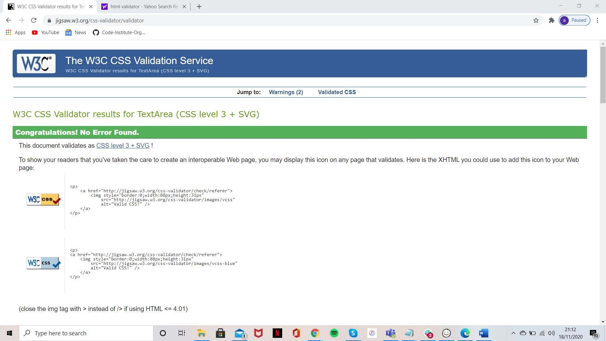

My site can be viewed here https://dwain-daniel.github.io/Milestone-Project-1/ 

<h1>Milestone Project</h1>

This project will be used to display all that I have learned so far. I will be using this project to build a website to describe what i can do and what i attain to do in the future. 
I will be using this website continuously as I learn new skills and adding new features progressively. At this moment in time i may not have all the skills
I would like to have to incorporate all the features that i would like to have in the finished article.

<h3>UX</h3>

I want my site to be quite minimalistic and simple whilst remaining effective. 
I would like any future employers to look at my site as an advert for what I can do as well as see the willingness to learn new skills.
It is important that users know what the site represents, I have tried to highlight this by my choice of Home page image as well as 
my "Full Stack Developer" title underneath my name. 
I have an attractive home page with links to the different pages of interest. These are clearly labelled to direct the user to my resume, and contact forms. This will be 
especially helpful for prospective employers. 
These links will remain the same in my header on every page throughout my project. All pages will be linked to each other, the user will not need to come back to the home page in order to reach a different page. 

I have included my Balsamiq template for my project. 

<h3>Features</h3>

In the top left of each page there is a link that will take the user back to the Home Page. This will be a link using "Dwain Daniel, Full Stack Developer"
The links in the header are consistent throughout the site and allow you to get to all pages from any page the user is on. The order of link are consistent, also using icons to 
help to better describe the links.
The links in the Resume section will take the user to the sites I have worked on previously (the ones listed are simply for examples)
The links under Contact Details will take the user to my social media pages and my Git Hub repository

<h3>Features left to implement</h3>

I would like to add a number of features going forward such as:  
<li>Link the Collaboration form to an external mailbox</li>
<li>Add a download Resume button/link</li>
<li>An online store selling packages for development ideas/pricing plans</li>

<h3> Technologies Used </h3>

I have built my site using: 

<h3>CSS</h3>
https://en.wikipedia.org/wiki/CSS 
CSS allows me to edit and decorate my site in the way I see fit. It gives me the ability to edit my HTML and create classes.

<h3>HTML</h3> 
https://en.wikipedia.org/wiki/HTML 

<h3>Bootstrap (v4.5.3)</h3> 
https://getbootstrap.com/ 
I used Bootstrap because it allowed me to build a responsive website with the limited knowledge and skills I currently have. It was also used in my Nav Bar and
to separate my divs into separate sizes across my site. 

<h3>Balsamiq</h3> 
https://balsamiq.com/# 
I used Balsamiq to help create my template website and try design a quality site. 

<h3>Font Awesome</h3> 
https://fontawesome.com/ 
Font Awesome was used on all pages throughout the website to add icons for aesthetic and UX purposes.

<h3>Google Fonts</h3> 
https://fonts.google.com/
Google fonts were used to import the 'Roboto' 'Exo' font into the style.css file which is used on all pages throughout the project.

<h3>jQuery</h3> 
https://jquery.com/ 
jQuery came with Bootstrap to make the navbar responsive but was also used for the smooth scroll function in JavaScript.

<h3>Testing</h3> 

I have tested my site thoroughly, all the links are working and take the user to the correct pages. 
The contact form is fully functioning, if the user inputs an invalid message into any text field then an error message will appear. For example an 
email address with no @ symbol will bring up an error.
The webpage will respond when used on smaller devices, the nav bar will shrink down into a drop down menu. 

I placed my site throught a CSS Validator which returned no errors  

I have viewed the site on both mobiles and laptop devices. On iPhones I have noticed that the mobile number was automatically made into a clickable link.
Whilst this is a helpful feature to promote interaction, the colour of the link is blue. This is similar to the colour of the background. This doesnt happen on the laptop.
I have tried to remove this using "< meta name="format-detection" content="telephone=no">"

<h3>Deployment</h3>

I have used GitHub Pages to deploy the page using the following steps:

<li>I logged in to GitHub and located the GitHub Repository Milestone Project 1</li>
<li>I then clicked the Settings button on the menu.</li>
<li>I scrolled down the Settings page to the "GitHub Pages" Section.</li>
<li>Under "Source" I selected "Master Branch".</li>
<li>The link was then published in the "GitHub Pages" section.</li>

<h3>Credits</h3>

Media - I found my images used on https://www.pexels.com/ and https://unsplash.com/  

<h3>Acknowledgements</h3> 

I received inspiration for my project from a website I designed on https://www.wix.com/dashboard/8382ebdf-1005-401b-acae-10f20c642ad9/home

Also I thank my mentor for helping me and providing the guidance I needed. 
